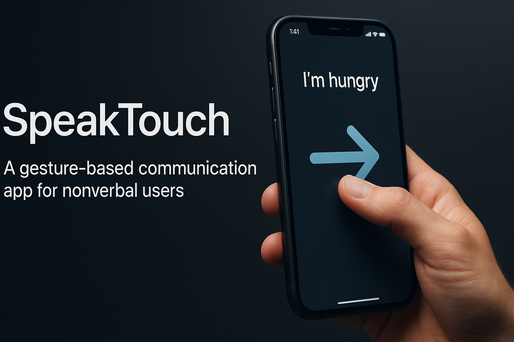

<p align="center">
  
</p>

<h1 align="center">SpeakTouch</h1>
<p align="center"><i>A gesture-based communication SaaS for nonverbal users.</i></p>

**SpeakTouch** is a SaaS solution developed in ReactJS/ViteJS designed to facilitate communication for individuals with speech difficulties through simple touch gestures.

---

## Installation Requirements

- Internet connection required
- OpenAI account with a valid API key

## Installation

1. Clone the repository
2. Add your OpenAI API key to the .env file at the root of the project :  
```VITE_OPENAI_API_KEY=your_api_key_here```
4. Install dependencies:  
```npm i```
5. Launch the application in development mode:  
```npm run dev:all```

**Important note:** The application requires an active Internet connection to function as it communicates with the OpenAI / SpeechSynthesis APIs.

---

## Key Features

- **Gesture Input:** Supports swipes and taps for communication.
- **AI powered suggestions:** Explain your situation to GPT and it generates personalised words.
- **Predefined Messages:** Maps specific gestures to predefined messages.
- **Audio Output:** Integrates Text-to-Speech (TTS) for voice output.
- **Kids Version:** Colorfull blocks for each gesture.
  
---

## Problem

Many individuals, including the elderly, autistic children, and post-operative patients, face challenges in verbal communication. Existing communication tools can be complex, visually overwhelming, or expensive. There is a need for an intuitive and affordable solution.

## Solution

SpeakTouch offers a simple and direct way for nonverbal users to express themselves. By performing basic gestures, users can trigger corresponding audio messages and haptic feedback. Examples:

Exemple:  
- Swipe Right → "I'm hungry"
- Swipe Left → "Bathroom"
- Double Tap → "Thank you"
- Two-finger Hold → "I need help"

## Target Users

- Elderly individuals experiencing speech loss.
- Children with communication difficulties.
- Patients recovering from surgery affecting speech.
- And many more...

## Future Enhancements

- AI-powered phrase suggestions.
- Customizable user interface themes.
